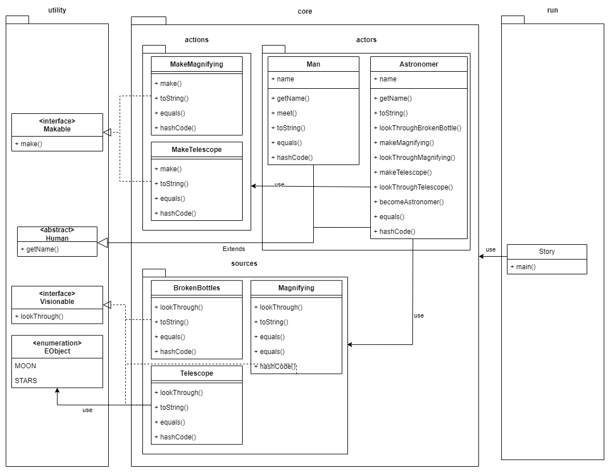

<p align="center">
  
</p>
<p align="center" style ="font-size: 24px"><em>Факультет мехатроники и робототехники</em></p>

<p align="center" style ="font-size: 24px"><strong>Лабораторная работа №1 </br>
По дисциплине : «Программирование»</br>
Вариант 215521</strong>
</p>
<p align="left">Преподаватель: <strong>Райла Мартин</strong></br>
Выполнил: <strong>Нгуен Тоан</strong></br>
Группа: <strong>R3137</strong>
</p>

# Лабораторная работа #3

## 1. Текст задания.
### Story
Он пошел домой и встретил знакомого, которого звали Стекляшкин. Этот Стекляшкин был знаменитый астроном. Он умел делать из осколков битых бутылок увеличительные стекла. Когда он смотрел в увеличительные стекла на разные предметы, то предметы казались больше. Из нескольких таких увеличительных стекол Стекляшкин сделал большую подзорную трубу, в которую можно было смотреть на Луну и на звезды. Таким образом он сделался астрономом.

He went home and met an acquaintance named Steklyashkin. This Steklyashkin was a famous astronomer. He knew how to make magnifying glasses from fragments of broken bottles. When he looked through magnifying glasses at different objects, the objects seemed larger. From several such magnifying glasses, Steklyashkin made a large telescope through which one could look at the moon and at the stars. Thus he became an astronomer.

### Class diagram


## 2. Sources
### 2.1. Utility Package
#### Human.java
```java
package utility;

public abstract class Human {
    public abstract String getName();
}
```
#### Makable.java
```java
package utility;

public interface Makable {
    void make(String name);
}
```
#### Visionable.java
```java
package utility;

public interface Visionable {
    void lookThrough(String name);
}
```

#### Objects.java
```java
package utility;

public enum Objects {
    MOON,
    STARS;
}
```

### 2.2. core package
#### 2.2.1. core.actions
##### MakeMagnifying.java
```java
package core.actions;

import utility.Makable;

public class MakeMagnifying implements Makable {
    @Override
    public int hashCode() {
        return super.hashCode();
    }

    @Override
    public boolean equals(Object obj) {
        return super.equals(obj);
    }

    @Override
    public String toString() {
        return super.toString();
    }

    @Override
    public void make(String name) {
        System.out.println(name + " knew how to make magnifying glasses from fragments of broken bottles");
    }
}
```
##### MakeTelescope.java
```java
package core.actions;

import utility.Makable;

public class MakeTelescope implements Makable {

    @Override
    public int hashCode() {
        return super.hashCode();
    }

    @Override
    public boolean equals(Object obj) {
        return super.equals(obj);
    }

    @Override
    public String toString() {
        return super.toString();
    }

    @Override
    public void make(String name) {
        System.out.println("From several such magnifying glasses, " + name + " made a large telescope");
    }
}
```

#### 2.2.2. core.source
##### BrokenBottles.java
```java
package core.sources;

import utility.Visionable;

public class BrokenBottles implements Visionable {
    @Override
    public int hashCode() {
        return super.hashCode();
    }

    @Override
    public boolean equals(Object obj) {
        return super.equals(obj);
    }

    @Override
    public String toString() {
        return super.toString();
    }

    @Override
    public void lookThrough(String name) {
        System.out.println(name + " can be look through broken bottles");
    }
}
```

##### Magnifying.java
```java
package core.sources;

import utility.Visionable;

public class Magnifying implements Visionable {
    @Override
    public int hashCode() {
        return super.hashCode();
    }

    @Override
    public boolean equals(Object obj) {
        return super.equals(obj);
    }

    @Override
    public String toString() {
        return super.toString();
    }

    @Override
    public void lookThrough(String name) {
        System.out.println(name + " looked through magnifying glasses at different objects, the objects seemed larger");
    }
}
```

##### Telescope.java
```java
package core.sources;

import utility.Objects;
import utility.Visionable;

public class Telescope implements Visionable {
    @Override
    public void lookThrough(String name) {
        System.out.println(name + "through large telescope could look at the "+ Objects.MOON+ " and at the "+Objects.STARS);
    }

    @Override
    public int hashCode() {
        return super.hashCode();
    }

    @Override
    public boolean equals(Object obj) {
        return super.equals(obj);
    }

    @Override
    public String toString() {
        return super.toString();
    }
}
```

#### 2.2.3. core.actors

##### Man.java
```java
package core.actors;

import utility.Human;

import java.util.Objects;

public class Man extends Human {
    private String name;

    public Man(String name) {
        this.name = name;
        joinStory();
    }

    private void joinStory() {
        System.out.println(name + " join in story");
    }

    @Override
    public String getName() {
        return name;
    }

    public void goHome(){
        System.out.println(name + " went home");
    }
    public void meet(Astronomer astronomer){
        System.out.println(name + " meet " + astronomer.getName());
    }

    @Override
    public String toString() {
        return "Man{" +
                "name='" + name + '\'' +
                '}';
    }

    @Override
    public boolean equals(Object object) {
        if (this == object) return true;
        if (object == null || getClass() != object.getClass()) return false;
        Man man = (Man) object;
        return Objects.equals(name, man.name);
    }

    @Override
    public int hashCode() {
        return Objects.hash(name);
    }
}
```

##### Astronomer.java
```java
package core.actors;

import core.actions.MakeMagnifying;
import core.actions.MakeTelescope;
import core.sources.BrokenBottles;
import core.sources.Magnifying;
import core.sources.Telescope;
import utility.Human;


public class Astronomer extends Human {
    private  String name;

    public Astronomer(String name) {
        this.name = name;
        joinStory();
    }

    private void joinStory() {
        System.out.println(name + " join in story");
    }

    public void becomeAstronomer(){
        System.out.println(name + " became an astronomer");
    }

    public void lookThroughBrokenBottles(){
        BrokenBottles brokenBottles = new BrokenBottles();
        brokenBottles.lookThrough(name);
    }

    public void makeMagnifying(){
        MakeMagnifying action = new MakeMagnifying();
        action.make(name);
    }

    public void lookThroughMagnifying(){
        Magnifying magnifying = new Magnifying();
        magnifying.lookThrough(name);
    }

    public void makeTelescope(){
        MakeTelescope action = new MakeTelescope();
        action.make(name);
    }

    public void lookThroughTelescope(){
        Telescope telescope = new Telescope();
        telescope.lookThrough(name);
    }


    @Override
    public int hashCode() {
        return super.hashCode();
    }

    @Override
    public boolean equals(Object obj) {
        return super.equals(obj);
    }

    public String toString() {
        return name +" was a famous astronomer";
    }

    @Override
    public String getName() {
        return name;
    }
}
```
### 2.3. run package
#### Story.java
```java
package run;

import core.actors.Astronomer;
import core.actors.Man;

public class Story {
    public static void main(String[] args) {
        Man man = new Man("Man");
        man.goHome();

        Astronomer astronomer = new Astronomer("Steklyashkin");
        man.meet(astronomer);

        System.out.println(astronomer.toString());
        astronomer.lookThroughBrokenBottles();
        astronomer.makeMagnifying();
        astronomer.lookThroughMagnifying();
        astronomer.makeTelescope();
        astronomer.lookThroughTelescope();
        astronomer.becomeAstronomer();
    }
}
```

## 3. Results
```java
Man join in story
Man went home
Steklyashkin join in story
Man meet Steklyashkin
Steklyashkin was a famous astronomer
Steklyashkin can be look through broken bottles
Steklyashkin knew how to make magnifying glasses from fragments of broken bottles
Steklyashkin looked through magnifying glasses at different objects, the objects seemed larger
From several such magnifying glasses, Steklyashkin made a large telescope
Steklyashkinthrough large telescope could look at the MOON and at the STARS
Steklyashkin became an astronomer
```

## 4. Conclusion

В этой лабораторной работе я научился применять принципы SOLID на практике, применять соглашения об именах Java, более внимательно изучать интерфейсы, абстрактные классы и перечисления. Узнал, как использовать систему сборки Gradle. Не выспался :(

In this lab, I learned how to put the principles of SOLID in practice, apply Java naming conventions, take a closer look at interfaces, abstract classes, and enumerations. Learned how to use the Gradle build system. Not getting enough sleep.
